# AvatarTLA

- AvatarTLA provides color palettes inspired by characters and nations
  from the animated series Avatar: The Last Airbender for R graphics.
  The package structure and syntax are modeled after the popular
  [wesanderson](https://github.com/karthik/wesanderson/tree/master)
  package.

# Installation

- You can install the development version of AvatarTLA from GitHub with:

``` r
# install.packages("devtools")
devtools::install_github("Gerardo-Manzanarez-Villasana/AvatarTLA")
```

# Usage

``` r
library("AvatarTLA")

library(ggplot2)

# List all available palette names
names(avatar_palettes)
#>  [1] "Mai"          "Suki"         "Iroh"         "FireNation"   "AirNomads"   
#>  [6] "EarthKingdom" "WaterTribe"   "Appa"         "Sokka"        "Toph"        
#> [11] "Azula"        "Aang"         "Zuko"         "Katara"       "Ty"          
#> [16] "Momo"
```

# Palette Previews

- You can inspect all available palettes using avatar_palette()

# Characters

# Aang

# Inspiration

<figure>

<figcaption aria-hidden="true">Aang, the Last Airbender by
Yueko</figcaption>
</figure>

# Color palette inspired by Aang

``` r
avatar_palette("Aang")
```

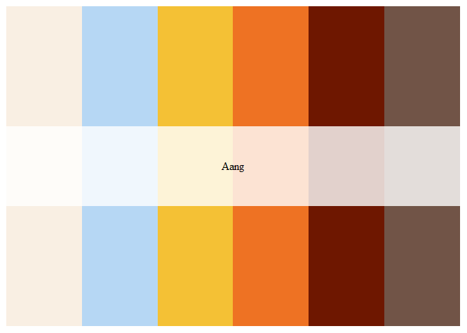

# Toph

# Inspiration

<figure>

<figcaption aria-hidden="true">Toph, the Blind Bandit by
Yueko</figcaption>
</figure>

# Color palette inspired by Toph

``` r
avatar_palette("Toph")
```

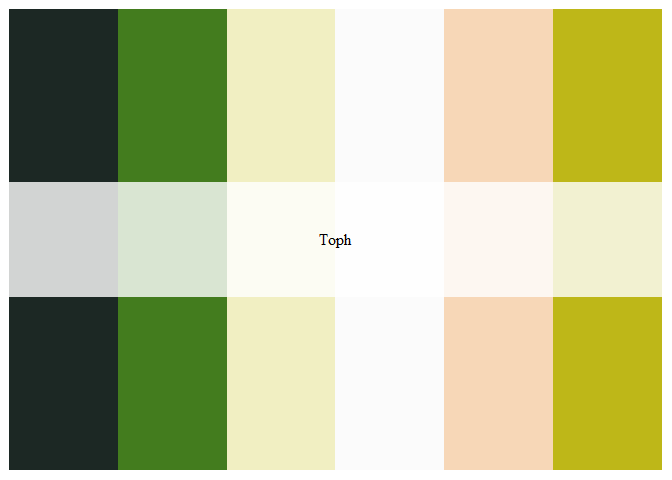

# Mai

``` r
avatar_palette("Mai")
```

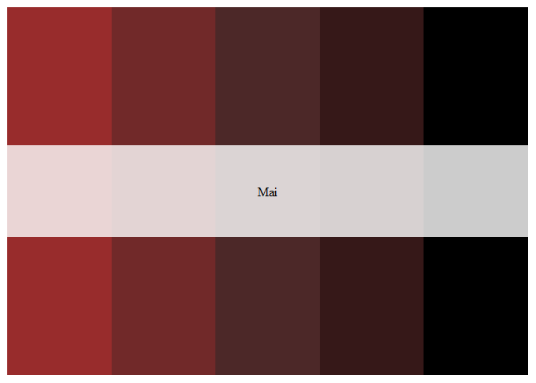

# Suki

``` r
avatar_palette("Suki")
```

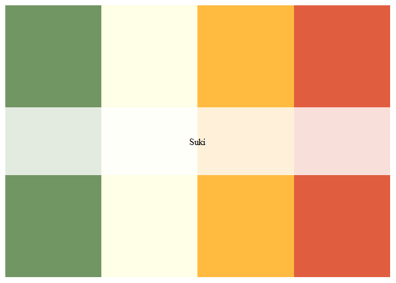

# Discrete bar plot with Suki palette (4 colors)

``` r
ggplot(mpg, aes(x = drv, fill = drv)) +
  geom_bar() +
  scale_fill_manual(values = avatar_palette("Suki")) +
  theme_minimal() +
  labs(
    title = "Drive Trains with Suki Palette",
    x = "Drive Train",
    y = "Count"
  ) +
  theme(legend.position = "none")
```

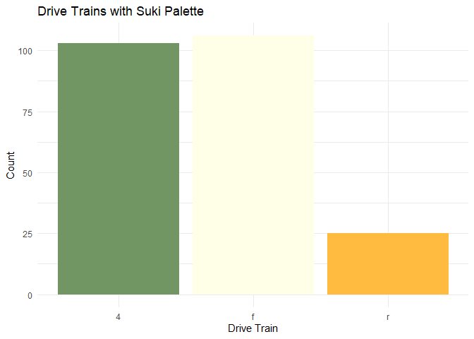

# Momo

``` r
avatar_palette("Momo")
```

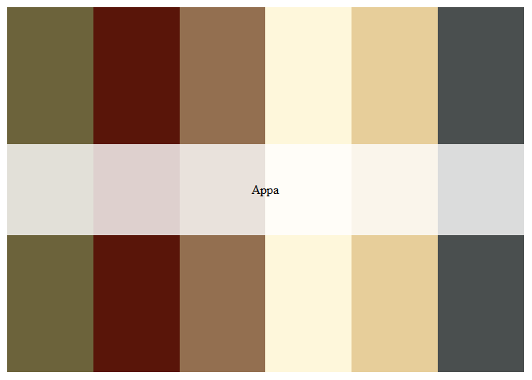

# Iroh

``` r
avatar_palette("Iroh")
```

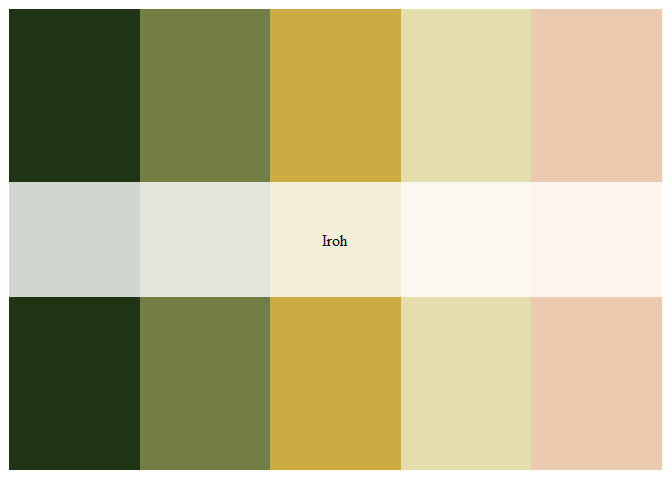

# Appa

``` r
avatar_palette("Appa")
```


# Sokka

``` r
avatar_palette("Sokka")
```

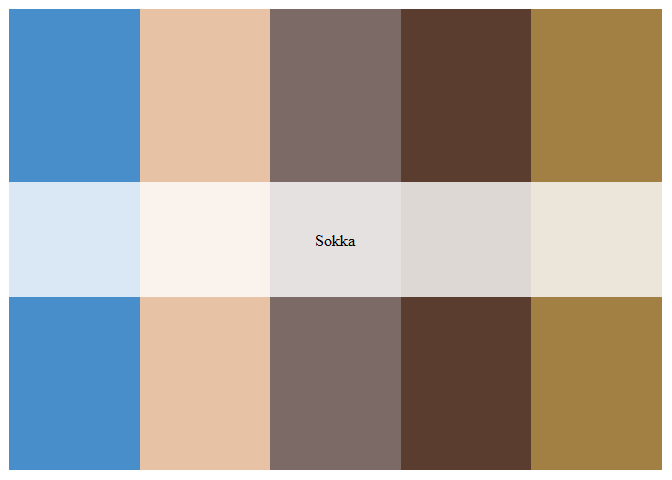

# Azula

``` r
avatar_palette("Azula")
```

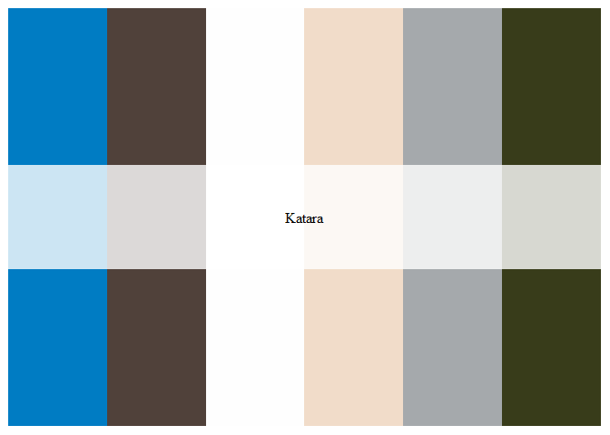

# Boxplot with Azula palette (subset to 3 colors)

``` r
ggplot(iris, aes(x = Species, y = Sepal.Length, fill = Species)) +
  geom_boxplot() +
  scale_fill_manual(values = avatar_palette("Azula", 3)) +
  theme_light() +
  labs(
    title = "Sepal Length Across Species",
    x = "Species",
    y = "Sepal Length (cm)"
  )
```

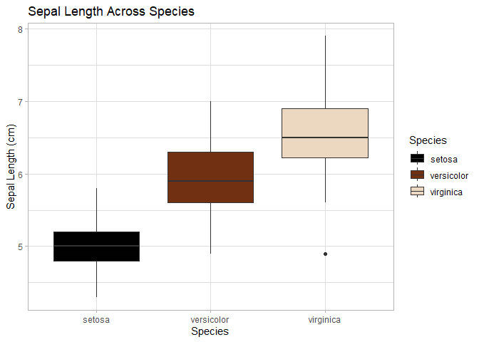

# Zuko

``` r
avatar_palette("Zuko")
```


# Katara

``` r
avatar_palette("Katara")
```


# Ty Lee

``` r
avatar_palette("Ty")
```

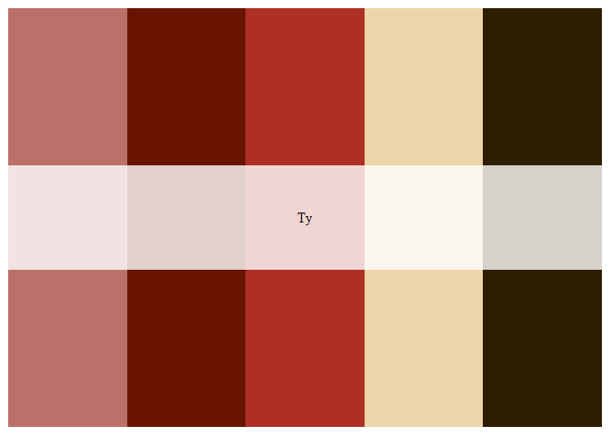

# Avatar Nations

# Fire Nation

``` r
avatar_palette("FireNation")
```

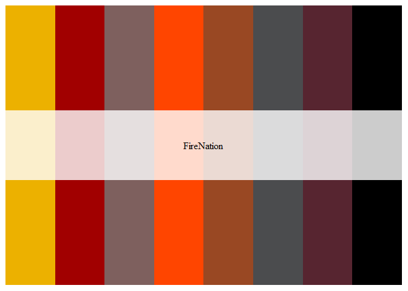

# Air Nomads

``` r
avatar_palette("AirNomads")
```

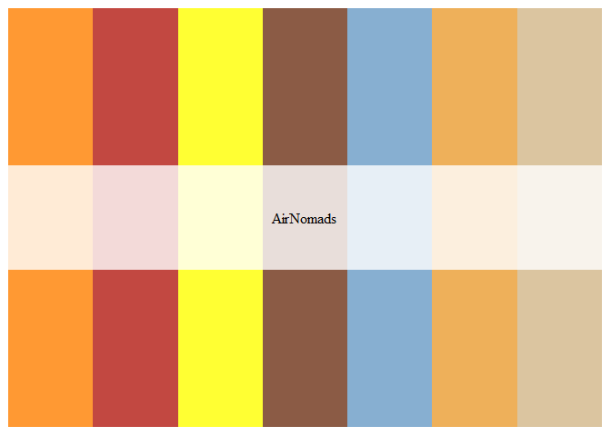

# Earth Kingdom

``` r
avatar_palette("EarthKingdom")
```

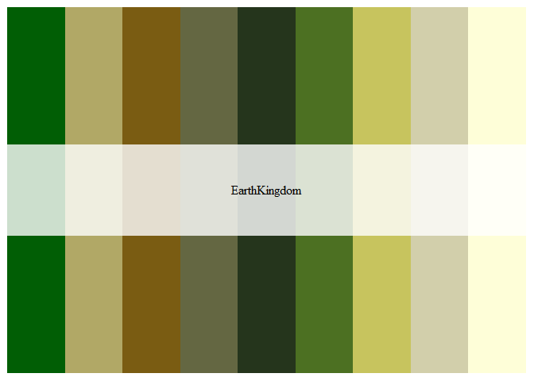

# Continuous heatmap using the EarthKingdom palette

``` r
ggplot(faithfuld, aes(x = eruptions, y = waiting, fill = density)) +
  geom_tile() +
  scale_fill_gradientn(colors = avatar_palette("EarthKingdom", 100, type = "continuous")) +
  theme_minimal() +
  labs(
    title = "Old Faithful Eruption Density",
    x = "Eruption Duration (min)",
    y = "Waiting Time (min)",
    fill = "Density"
  )
```

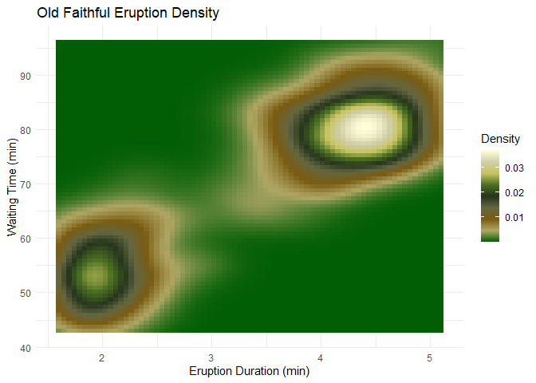

# Water Tribe

``` r
avatar_palette("WaterTribe")
```

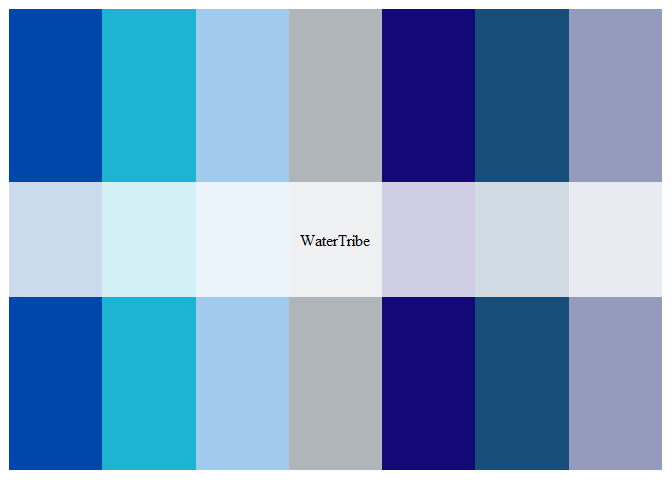

# Credits

# Logo

- The logo was created by the artist [Adri Alicee
  Art](https://www.instagram.com/daydrawing97/?hl=es-la)

# Nation Palettes

- The nation palettes were inspired by the [tvthemes
  1.3.1](https://github.com/Ryo-N7/tvthemes) package. Credit goes to its
  authors

# Character Palettes

- The color palettes for the characters—Suki, Mai, and Momo—were created
  by me with the help of the [Coolors](https://coolors.co) website
- The rest of the characters’ palettes were taken from the
  [Schemecolor](https://www.schemecolor.com/palettes/avatar-the-last-airbender)
  website. All credit goes to their respective creators

# Character Images

- The sample images shown are for illustrative purposes only. The
  creators of the Nickelodeon series are Michael Dante DiMartino and
  Bryan Konietzko

# 

Feel free to leave character suggestions or any comments

Best regards

**Gerardo Manzanarez-Villasana**

**Glochids are forever**
